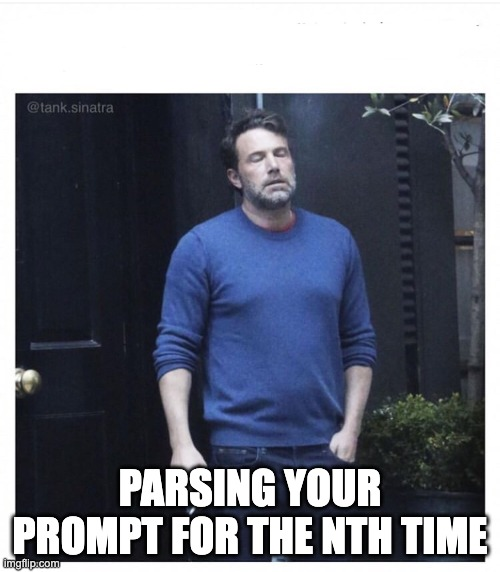

<div align="center">


# wdym 🗣️❓


</div>


A Claude Code skill that **rewrites your prompts before they run**. It fires
automatically on every prompt submission, detects what the prompt is about,
applies a small set of academically-grounded prompting principles, and
(in the default mode) shows you the enhanced version for approval before it runs.

```
You type:     fix the bug in my parser
wdym rewrites: Debug the failing parser in <file>. Describe the input that
               triggers the bug, the expected vs. actual output, and the fix —
               with a minimal test that reproduces it.
```

## How it works

1. **Hook pre-scores** — a `UserPromptSubmit` hook (`hooks/prompt-detect.py`)
   deterministically classifies the prompt against `refs/categories.json` and
   injects a `<prompt-detect>` block. Zero tokens, runs every submission.
2. **Skill routes** — the skill reads that verdict, loads the matching principle
   pool (a universal base, plus one type-specific layer), selects the top 2–3
   principles, and rewrites the prompt.
3. **You decide** — in `comprehensive` mode it presents the rewrite for approval;
   in `flash` mode it rewrites and runs immediately.

`prompt_type` ∈ `code` · `question` · `text-gen` · `none`. Slash commands,
≤5-word prompts, and conversational follow-ups pass through untouched.

## Install

```
/wdym --init            # asks: local (this dir) or global (~/.claude)?
/wdym --init --local    # skip the question — local scope
/wdym --init --global   # skip the question — global scope
```

Init writes the pref file and wires the hook with an absolute path. It is
idempotent — never overwrites an existing pref, never duplicates the hook.

## Commands

| Command | Effect |
|---------|--------|
| `/wdym --init [--local\|--global]` | Install the pref file + wire the hook |
| `/wdym --set-mode --flash` / `--comprehensive` | Permanently switch the run mode |
| `--flash` / `--comprehensive` (inline) | Switch mode and continue this run |
| `--global` (inline) | Force the universal base, skip type detection |
| `/wdym --status` (alias `--stats`) | Print the styled local usage report |

## Run modes

| Mode | Behaviour |
|------|-----------|
| `comprehensive` (default) | Presents the rewrite for approval, then asks whether to run it |
| `flash` | Rewrites and runs immediately — no gates |

The mode persists in `wdym/pref.json` (local `.claude/wdym/`, else global
`~/.claude/wdym/` — local wins).

## Self-healing

The skill verifies its own install on the first substantive prompt of each
session (protocol **Step 0.5**), against the known-good `refs/manifest.json`. It
already *degrades* gracefully when wounded; self-healing adds the recovery half —
`sense → repair → escalate` — so it doesn't run degraded forever and silently.

| Wound | Action |
|-------|--------|
| `pref.json` corrupt | Restore default `{"mode":"comprehensive"}` |
| `categories.json` missing | Restore from `refs/categories.default.json` |
| `categories.json` present-but-invalid | **Escalate** (may hold your edits — never clobbered) |
| Hook path stale (skill dir moved) | Re-wire the hook to the current absolute path |
| Hook not installed | Escalate → hint to run `/wdym --init` |
| Principle / telemetry script missing | Escalate (or fall back to global base) |

Two invariants: **missing files with a restore source are recreated**;
**present-but-invalid files that may hold user edits are escalated, never
clobbered**. The check is silent when everything is healthy — the happy path
pays nothing. The hook is self-reporting: a broken config makes it emit
`verdict: degraded` rather than failing silently, so the self-check can tell
"hook ran but config is broken" apart from "hook never ran".

## Telemetry

A **local, append-only** usage log lives at `<wdym_dir>/telemetry.jsonl` —
nothing leaves the machine. Two streams share the file:

- `src:"hook"` — one line per **submission** (deterministic): provisional type +
  passthrough flag.
- `src:"skill"` — one line per **transformed run**: final resolved type, mode,
  run mode, and outcome.

Read it back with `/wdym --status`. The stream is best-effort data, explicitly
**excluded** from self-healing (its absence is normal, a bad line is tolerated) —
telemetry can never block or alter a run.

## Layout

| Path | Role |
|------|------|
| `SKILL.md` | Skill definition and full reference |
| `refs/protocol.md` | Execution protocol — Step 0, Step 0.5, Steps 1–8 |
| `refs/detect.md` | Prompt-type detection protocol |
| `refs/categories.json` | Type taxonomy + signal cues (user-editable) |
| `refs/categories.default.json` | Pristine restore source (never edited) |
| `refs/manifest.json` | Known-good install definition for the self-check |
| `refs/init.md` | Bootstrap protocol for `--init` |
| `refs/principles/` | Principle tables (global base + per-type) + `examples.md` |
| `hooks/prompt-detect.py` | Deterministic pre-scorer + hook-side telemetry |
| `hooks/telemetry-stats.py` | Aggregator behind `/wdym --status` |
