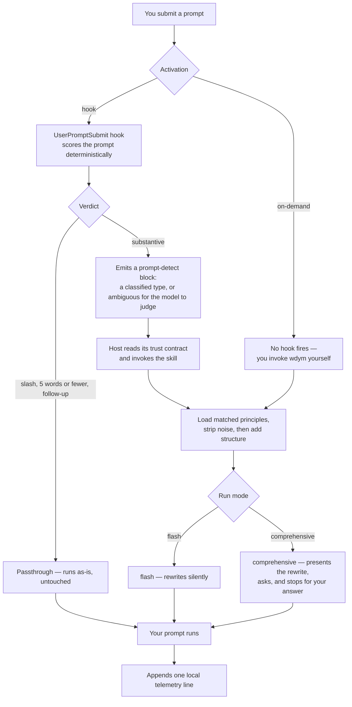

<div align="center"><pre>
██╗    ██╗██████╗ ██╗   ██╗███╗   ███╗
██║    ██║██╔══██╗╚██╗ ██╔╝████╗ ████║
██║ █╗ ██║██║  ██║ ╚████╔╝ ██╔████╔██║
██║███╗██║██║  ██║  ╚██╔╝  ██║╚██╔╝██║
╚███╔███╔╝██████╔╝   ██║   ██║ ╚═╝ ██║
 ╚══╝╚══╝ ╚═════╝    ╚═╝   ╚═╝     ╚═╝
</pre></div>

<p align="center"><strong>Rewrites your prompts into something your LLM can actually use — automatically, before it answers.</strong></p>

<p align="center">
  <a href="LICENSE.md"></a>
  
  
  
  <a href="https://github.com/ndisisnd/wdym/commits/main"></a>
</p>

<p align="center">
  <a href="#installation">Install</a> ·
  <a href="#how-it-works">How it works</a> ·
  <a href="#modes-and-flags">Modes</a> ·
  <a href="#faq">FAQ</a> ·
  <a href="llms.txt">llms.txt</a>
</p>

<p align="center"><sub>
  <b>AI agents / LLMs:</b> read <a href="llms.txt"><code>llms.txt</code></a>.
</sub></p>

---

## What it does

wdym catches every prompt you submit in Claude Code or Codex, works out what you're trying
to do, and rewrites it into a clearer version before your LLM sees it. You write the way
you'd talk; wdym hands the model something it can actually work with.

<div align="center"></div>
<br />

It runs as a one-time install and then stays out of your way:

- **Fires on its own.** A `UserPromptSubmit` hook intercepts each prompt — no command to remember.
- **Knows when not to.** Slash commands, prompts of five words or fewer, and "thanks" / "ok" / "continue" follow-ups pass straight through.
- **Detects the type.** It classifies each prompt as `code`, `question`, or `text-gen` and pulls the principles that fit that type.
- **Strips noise, then adds structure.** Politeness, threats, bribes, and hedging come out first; specificity, goals, and format go in.
- **Shows its work.** In the default mode you see the original, the rewrite, and why each change was made — then choose which one runs.

## Who is this for

Anyone who writes prompts faster than they polish them. If you use Claude Code or Codex
all day and your prompts come out as half-formed thoughts, wdym does the polishing so you
don't have to slow down. It's a single install per project or across every project, and
after that it's automatic.

## Installation

Three ways in. The npx installer is the only one that covers both hosts and finishes the
job in one command; the other two exist for people already committed to a particular tool.

### Option 1 — `npx wdym-prompt` _(recommended)_

```bash
npx wdym-prompt
```

That is the whole install. It detects which hosts you have — `~/.claude`, `~/.codex`, or
both — lays down the skill files, wires the `UserPromptSubmit` hook, writes the trust
contract into the host's instruction file, and creates your `pref.json`. **Global is the
default**, so wdym fires in every project you touch.

Say so explicitly when the defaults aren't what you want:

```bash
npx wdym-prompt --both              # Claude Code and Codex
npx wdym-prompt --claude --local    # this project only (Claude Code)
npx wdym-prompt --on-demand         # install inert; runs only via /wdym
```

| Flag | What it does |
|---|---|
| `--claude` / `--codex` / `--both` | Pick the host. Default: whichever of `~/.claude` and `~/.codex` exists |
| `--global`, `-g` | Global install — the default |
| `--local`, `-l` | Local install into `./.claude` for this project (Claude Code only) |
| `--dir <path>` | Local install into another project directory |
| `--hook` | Fire on every prompt — the default |
| `--on-demand` | Install inert; run only via `/wdym`, no hook wired |
| `--copy` | Copy the skill for Codex instead of symlinking it |
| `--doctor` | Report what is installed, wired, and in sync |
| `--uninstall` | Remove skill dirs, hook entries, and contract blocks |
| `--force` | Skip the guards (source-repo check, prefs on uninstall) |

Local always wins over global when both exist, so you can install globally and still
override one repo. Re-run the installer any time — it is idempotent, keeps your `pref.json`
and telemetry, and collapses a duplicated hook entry back to one if an earlier install left
two behind. It needs Node 18 or newer and installs no dependencies.

#### Installing for Codex

Four things worth knowing, none of them blockers:

- **Hooks are on by default in Codex**, so there is nothing to enable first.
- **Codex trusts hooks by file contents**, so every install or update needs one manual
  step: run `/hooks` inside Codex and approve the wdym hook. Until you do, wdym stays
  silent and Codex will not warn you — prompts simply pass through unchanged. The
  installer prints this reminder last on every Codex run. To confirm it worked: submit any
  prompt, then run `$wdym --status`.
- **The classification block is currently visible.** Codex renders hook context as a
  visible developer message ([openai/codex#16933](https://github.com/openai/codex/issues/16933),
  still open), so wdym's one-line signal shows up above the answer. Cosmetic only.
- **Global scope only.** `--codex --local` is refused on purpose: a repo-scoped Codex hook
  lives in a committed file, which would hand every teammate an approval prompt for a tool
  they never installed.

Codex users type `$wdym` where this README writes `/wdym`. Everything else is identical.

### Option 2 — the shell installer _(Claude Code only)_

`install.sh` is frozen at what it does today: Claude Code, no Codex support, no new flags.
It stays fully supported for anyone already using it.

```bash
curl -fsSL https://raw.githubusercontent.com/ndisisnd/wdym/main/install.sh | bash
```

It pulls a tarball into a temp dir — no clone, nothing left behind. Global by default; add
`-s -- --local` for one project:

```bash
curl -fsSL https://raw.githubusercontent.com/ndisisnd/wdym/main/install.sh | bash -s -- --local
```

| Flag | What it does |
|---|---|
| _(none)_ | Global install into `~/.claude` — the default |
| `--local` | Local install into `./.claude` for this project |
| `--hook` | Fire on every prompt — the default |
| `--on-demand` | Install inert; run only via `/wdym`, no hook wired |
| `--dir <path>` | Local install into another project |
| `--tarball <url\|path>` | Install from a specific tarball instead of `main` |
| `--force` | Skip the "you're inside the wdym repo" guard |

Like the npx installer it writes your `pref.json`, wires the detector, and is safe to
re-run. Already have the files on disk and just want to rewire? `/wdym --init` does the
init half on its own.

### Option 3 — `npx skills add`

If you already manage skills with the [skills CLI](https://github.com/vercel-labs/skills),
wdym installs like any other package:

```bash
npx skills add ndisisnd/wdym          # this project
npx skills add ndisisnd/wdym -g       # every project (user-level)
```

Then finish the setup:

```
/wdym --init
```

**That second step isn't optional.** `skills add` delivers the skill files and stops
there — it's a package manager, not wdym's installer. It doesn't know wdym has a hook to
wire, a `pref.json` to write, or a trust contract to install. Without `--init` you get a
skill that only answers to `/wdym` and never fires on its own.

`/wdym --init` asks you the same two questions the installers take as flags — scope
(local or global) and activation (hook or on-demand) — then writes all three pieces.

### Which one to use

| | `npx wdym-prompt` | `install.sh` | `npx skills add` |
|---|---|---|---|
| Claude Code | ✅ | ✅ | files only |
| Codex | ✅ | ❌ frozen, never supported it | ❌ use `npx wdym-prompt` |
| Skill files | ✅ | ✅ | ✅ |
| `pref.json`, hook, trust contract | ✅ | ✅ Claude Code only | via `/wdym --init` |
| Updates | re-run it | re-run it | `npx skills update` |
| What lands in the skill dir | curated runtime files only | curated runtime files only | the whole repo, `install.sh` and `tests/` included |
| Also writes | nothing else | nothing else | `skills-lock.json` at your project root |

All three land the skill in the same place — `.claude/skills/wdym` for project scope,
`~/.claude/skills/wdym` for global — so pick whichever fits your workflow. `/wdym --init`
is idempotent across all of them.

### Confirming it works

To confirm it's wired up, submit any normal prompt: in the default mode you'll see the
rewrite and a gate before it runs. `npx wdym-prompt --doctor` checks the same thing from
the outside — which hosts are wired, and on Codex it reminds you to confirm hook approval
with `/hooks`, which only Codex itself can tell you.

## How it works

Just write, and wdym translates it for you.


```mermaid
flowchart TD
    submit["You submit a prompt"]
    activation{"Activation"}
    hook["UserPromptSubmit hook<br/>scores the prompt deterministically"]
    manual["No hook fires —<br/>you invoke wdym yourself"]
    verdict{"Verdict"}
    skip["Passthrough — runs as-is, untouched"]
    block["Emits a prompt-detect block:<br/>a classified type, or ambiguous for the model to judge"]
    contract["Host reads its trust contract<br/>and invokes the skill"]
    skill["Load matched principles,<br/>strip noise, then add structure"]
    mode{"Run mode"}
    flash["flash — rewrites silently"]
    comprehensive["comprehensive — presents the rewrite,<br/>asks, and stops for your answer"]
    run["Your prompt runs"]
    telemetry["Appends one local telemetry line"]

    submit --> activation
    activation -->|"hook"| hook
    activation -->|"on-demand"| manual
    hook --> verdict
    verdict -->|"slash, 5 words or fewer, follow-up"| skip
    verdict -->|substantive| block
    block --> contract
    contract --> skill
    manual --> skill
    skill --> mode
    mode -->|flash| flash
    mode -->|comprehensive| comprehensive
    flash --> run
    comprehensive --> run
    skip --> run
    run --> telemetry
```

**Two hosts, one flow.** That path is the same on Claude Code and on Codex. Only four
plumbing details differ, and the installer handles all four for you:

| | Claude Code | Codex |
|---|---|---|
| Trust contract | `~/.claude/CLAUDE.md` | `~/.codex/AGENTS.md` |
| Skill path | `~/.claude/skills/wdym` | `~/.agents/skills/wdym` — a symlink to the Claude Code copy |
| Hook file | `~/.claude/settings.json` | `~/.codex/hooks.json` |
| Asking you | `AskUserQuestion` tool | plain-text question, then it stops and waits |

The same path in words:

1. **Catches it** — a `UserPromptSubmit` hook intercepts the prompt. Slash commands, ≤5-word prompts, and "thanks" / "ok" / "continue" follow-ups wave straight through untouched — no ceremony for small talk.
2. **Figures out what you meant** — classifies the prompt as `code`, `question`, `text-gen`, or `none`. ~95% of real prompts resolve deterministically in the hook (zero tokens); only genuinely mixed signals go to the LLM to adjudicate.
3. **Loads the right playbook** — pulls the global principles plus the ones for your prompt type, then picks the top 2–3 that actually apply. It strips noise (politeness, threats, bribes, hedging) _before_ adding structure (specificity, goals, format).
4. **Rewrites it** — turns your input into something your LLM can chew on, and shows you _why_ each change was made.
5. **Ships it** — how it submits depends on your run mode (see below). Either way your prompt always runs; rejecting the rewrite never eats your question.

For the full flow, file map, and design notes, see [ARCHITECTURE.md](ARCHITECTURE.md).

## Modes and flags

wdym runs in two persistent **run modes** and takes a handful of **flags**. Drop any of
these into a prompt _(or run them standalone)_:

| Mode / Flag | What it does |
|---|---|
| `comprehensive` _(default)_ | Shows you the original, the rationale, and the enhanced prompt — then one 3-way gate: **run enhanced · run original · edit**. Cautious by design, but your prompt always runs. |
| `flash` | Skips the gate entirely. Rewrites your prompt and fires it off immediately — and never inserts `[fill-this-in]` placeholders, since nothing would fill them. |
| `--flash` / `--comprehensive` | Permanently switch your stored run mode (add `--set-mode` to switch _without_ touching the current prompt). |
| `--global` | Forces the universal principle base and skips type detection for this run. Good for one-off, type-agnostic prompts. |
| `--init` | Bootstraps the skill — writes `pref.json`, wires the hook, and installs the trust contract, asking scope and activation. |
| `--status` _(alias `--stats`)_ | Prints a styled usage report — prompts seen, transform rate, a ranked by-type breakdown. Telemetry stays 100% local. |
| `--help` | Lists all commands, modes, and prompt types with one-liners. |

## How to update

**Update wdym itself** by re-running the installer you used. Both are idempotent and
neither touches your `pref.json` or telemetry:

```bash
npx wdym-prompt                                                                   # either host
curl -fsSL https://raw.githubusercontent.com/ndisisnd/wdym/main/install.sh | bash  # Claude Code
```

**If you installed with `npx skills add`**, update through the same CLI:

```bash
npx skills update wdym
```

**On Codex, re-approve after every update.** Codex trusts hooks by file contents, so an
update invalidates the old approval — run `/hooks` in Codex and approve the wdym hook
again, or it goes quiet without saying so.

**Rewire an install you already have on disk** — after editing settings by hand, if the
hook came unwired, or after a `skills update` — with `/wdym --init`, which redoes the init
half without reinstalling.

**Check what's actually wired** with `npx wdym-prompt --doctor`: it reports each host, the
skill copies, and whether they are in sync. Codex hook approval is the one thing it can't
read — it lives inside Codex, so `--doctor` points you at `/hooks` to confirm it.

## FAQ

**Does it cost tokens on every prompt?** Mostly no. The hook scores each prompt
deterministically with keyword and regex matching, so ~95% of real prompts resolve to a
type with zero model tokens. Only genuinely ambiguous prompts go to the LLM to adjudicate.

**What if I like my original prompt?** In the default `comprehensive` mode nothing is
rewritten behind your back — you see the diff and a three-way gate, and "run original" is
always one of the choices. Rejecting the rewrite never drops your prompt.

**Will it rewrite my slash commands and one-liners?** No. Slash commands, prompts of five
words or fewer, and short follow-ups like "thanks", "ok", and "continue" pass straight
through untouched.

**Where does my usage data go?** Nowhere. Telemetry is an append-only local file
(`telemetry.jsonl`) in the install directory, read only by `/wdym --status`. It never
leaves your machine.

**Global or local install?** Global is the default and covers every project. Install
`--local` when you want it scoped to one repo; a local install always wins over the global
one, so you can do both. Codex is global-only — see the Codex notes under Installation.

**Does it work with Codex?** Yes, from v1.2.0. `npx wdym-prompt --codex` (or `--both`)
wires it: the skill is exposed at `~/.agents/skills/wdym`, the hook goes into
`~/.codex/hooks.json`, and the trust contract into `~/.codex/AGENTS.md`. One manual step
remains — approve the hook with `/hooks` inside Codex after every install or update.

## License

[MIT](LICENSE.md)

## Acknowledgments

- [mkpub](https://github.com/ndisisnd/mkpub) for generating this README

<!-- mkpub: not generatable — who or what actually helped. People, prior art, libraries
     you leaned on, the README you copied the structure from. Delete this section if
     there's nothing honest to put here. -->

---

Dedicated to JC 🍙, who runs 10x more prompts than I do.
