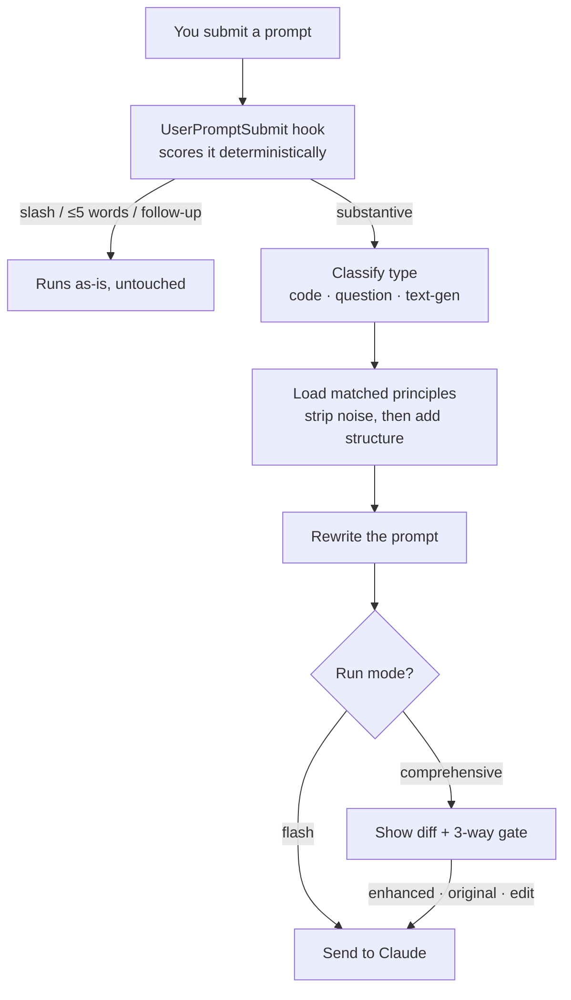

<div align="center"><pre>
██╗    ██╗██████╗ ██╗   ██╗███╗   ███╗
██║    ██║██╔══██╗╚██╗ ██╔╝████╗ ████║
██║ █╗ ██║██║  ██║ ╚████╔╝ ██╔████╔██║
██║███╗██║██║  ██║  ╚██╔╝  ██║╚██╔╝██║
╚███╔███╔╝██████╔╝   ██║   ██║ ╚═╝ ██║
 ╚══╝╚══╝ ╚═════╝    ╚═╝   ╚═╝     ╚═╝
</pre></div>

<p align="center"><strong>Rewrites your prompts into something your LLM can actually use — automatically, before it answers.</strong></p>

<p align="center">
  <a href="LICENSE.md"></a>
  
  
  <a href="https://github.com/ndisisnd/wdym/commits/main"></a>
</p>

<p align="center">
  <a href="#installation">Install</a> ·
  <a href="#how-it-works">How it works</a> ·
  <a href="#modes-and-flags">Modes</a> ·
  <a href="#faq">FAQ</a> ·
  <a href="llms.txt">llms.txt</a>
</p>

<p align="center"><sub>
  <b>AI agents / LLMs:</b> read <a href="llms.txt"><code>llms.txt</code></a>.
</sub></p>

---

## What it does

wdym catches every prompt you submit in Claude Code, works out what you're trying to do,
and rewrites it into a clearer version before your LLM sees it. You write the way you'd
talk; wdym hands the model something it can actually work with.

<div align="center"></div>

It runs as a one-time install and then stays out of your way:

- **Fires on its own.** A `UserPromptSubmit` hook intercepts each prompt — no command to remember.
- **Knows when not to.** Slash commands, prompts of five words or fewer, and "thanks" / "ok" / "continue" follow-ups pass straight through.
- **Detects the type.** It classifies each prompt as `code`, `question`, or `text-gen` and pulls the principles that fit that type.
- **Strips noise, then adds structure.** Politeness, threats, bribes, and hedging come out first; specificity, goals, and format go in.
- **Shows its work.** In the default mode you see the original, the rewrite, and why each change was made — then choose which one runs.

## Who is this for

Anyone who writes prompts faster than they polish them. If you use Claude Code (or any
LLM) all day and your prompts come out as half-formed thoughts, wdym does the polishing
so you don't have to slow down. It's a single install per project or across every project,
and after that it's automatic.

## Installation

`cd` into the project you want `wdym` in, then:

```bash
curl -fsSL https://raw.githubusercontent.com/ndisisnd/wdym/main/install.sh | bash
```

The installer pulls a tarball into a temp dir — no clone, nothing left behind. **Global is
the default**: the skill lands in `~/.claude/skills/wdym`, the hook goes into
`~/.claude/settings.json`, and `wdym` fires across every project you touch.

Want it scoped to just this project? Ask for it explicitly:

```bash
curl -fsSL https://raw.githubusercontent.com/ndisisnd/wdym/main/install.sh | bash -s -- --local
```

That installs into `./.claude/` and wires `./.claude/settings.local.json`, so only this
project gets the treatment. Local always wins over global when both exist, so you can run
it globally and still override per-project.

| Flag | What it does |
|---|---|
| _(none)_ | Global install into `~/.claude` — the default |
| `--local` | Local install into `./.claude` for this project |
| `--dir <path>` | Local install into another project |
| `--tarball <url\|path>` | Install from a specific tarball instead of `main` |
| `--force` | Skip the "you're inside the wdym repo" guard |

Both scopes write your `pref.json` (where your run mode lives) and wire up the
`UserPromptSubmit` detector in one shot. It's idempotent — run it again any time and it
won't clobber your prefs. Already have the files on disk and just want to rewire?
`/wdym --init` does the init half on its own.

To confirm it's wired up, submit any normal prompt: in the default mode you'll see the
rewrite and a gate before it runs.

## How it works

Just write, and wdym translates it for you.


```mermaid
flowchart TD
    submit["You submit a prompt"]
    hook["UserPromptSubmit hook<br/>scores it deterministically"]
    passthrough["Runs as-is, untouched"]
    classify["Classify type<br/>code · question · text-gen"]
    principles["Load matched principles<br/>strip noise, then add structure"]
    rewrite["Rewrite the prompt"]
    gate{"Run mode?"}
    ask["Show diff + 3-way gate"]
    send["Send to Claude"]

    submit --> hook
    hook -->|"slash / ≤5 words / follow-up"| passthrough
    hook -->|substantive| classify
    classify --> principles --> rewrite --> gate
    gate -->|comprehensive| ask
    gate -->|flash| send
    ask -->|"enhanced · original · edit"| send
```

1. **Catches it** — a `UserPromptSubmit` hook intercepts the prompt. Slash commands, ≤5-word prompts, and "thanks" / "ok" / "continue" follow-ups wave straight through untouched — no ceremony for small talk.
2. **Figures out what you meant** — classifies the prompt as `code`, `question`, `text-gen`, or `none`. ~95% of real prompts resolve deterministically in the hook (zero tokens); only genuinely mixed signals go to the LLM to adjudicate.
3. **Loads the right playbook** — pulls the global principles plus the ones for your prompt type, then picks the top 2–3 that actually apply. It strips noise (politeness, threats, bribes, hedging) _before_ adding structure (specificity, goals, format).
4. **Rewrites it** — turns your input into something your LLM can chew on, and shows you _why_ each change was made.
5. **Ships it** — how it submits depends on your run mode (see below). Either way your prompt always runs; rejecting the rewrite never eats your question.

For the full flow, file map, and design notes, see [ARCHITECTURE.md](ARCHITECTURE.md).

## Modes and flags

wdym runs in two persistent **run modes** and takes a handful of **flags**. Drop any of
these into a prompt _(or run them standalone)_:

| Mode / Flag | What it does |
|---|---|
| `comprehensive` _(default)_ | Shows you the original, the rationale, and the enhanced prompt — then one 3-way gate: **run enhanced · run original · edit**. Cautious by design, but your prompt always runs. |
| `flash` | Skips the gate entirely. Rewrites your prompt and fires it off immediately — and never inserts `[fill-this-in]` placeholders, since nothing would fill them. |
| `--flash` / `--comprehensive` | Permanently switch your stored run mode (add `--set-mode` to switch _without_ touching the current prompt). |
| `--global` | Forces the universal principle base and skips type detection for this run. Good for one-off, type-agnostic prompts. |
| `--init` | Bootstraps the skill — writes `pref.json` and wires the hook, asking local vs. global scope. |
| `--status` _(alias `--stats`)_ | Prints a styled usage report — prompts seen, transform rate, a ranked by-type breakdown. Telemetry stays 100% local. |
| `--help` | Lists all commands, modes, and prompt types with one-liners. |

## How to update

**Update wdym itself** by re-running the installer — it's idempotent and won't touch your
`pref.json` or telemetry:

```bash
curl -fsSL https://raw.githubusercontent.com/ndisisnd/wdym/main/install.sh | bash
```

**Rewire an install you already have on disk** — after editing settings by hand, or if the
hook came unwired — with `/wdym --init`, which redoes the init half without reinstalling.

## FAQ

**Does it cost tokens on every prompt?** Mostly no. The hook scores each prompt
deterministically with keyword and regex matching, so ~95% of real prompts resolve to a
type with zero model tokens. Only genuinely ambiguous prompts go to the LLM to adjudicate.

**What if I like my original prompt?** In the default `comprehensive` mode nothing is
rewritten behind your back — you see the diff and a three-way gate, and "run original" is
always one of the choices. Rejecting the rewrite never drops your prompt.

**Will it rewrite my slash commands and one-liners?** No. Slash commands, prompts of five
words or fewer, and short follow-ups like "thanks", "ok", and "continue" pass straight
through untouched.

**Where does my usage data go?** Nowhere. Telemetry is an append-only local file
(`telemetry.jsonl`) in the install directory, read only by `/wdym --status`. It never
leaves your machine.

**Global or local install?** Global is the default and covers every project. Install
`--local` when you want it scoped to one repo; a local install always wins over the global
one, so you can do both.

## License

[MIT](LICENSE.md)

## Acknowledgments

- [mkpub](https://github.com/ndisisnd/mkpub) for generating this README

<!-- mkpub: not generatable — who or what actually helped. People, prior art, libraries
     you leaned on, the README you copied the structure from. Delete this section if
     there's nothing honest to put here. -->

---

Dedicated to JC 🍙, who runs 10x more prompts than I do.
